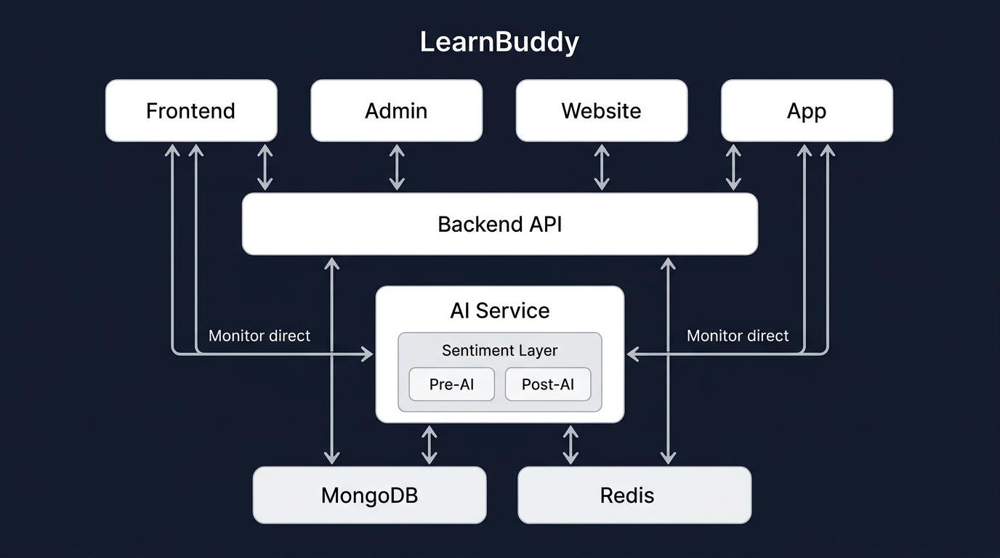
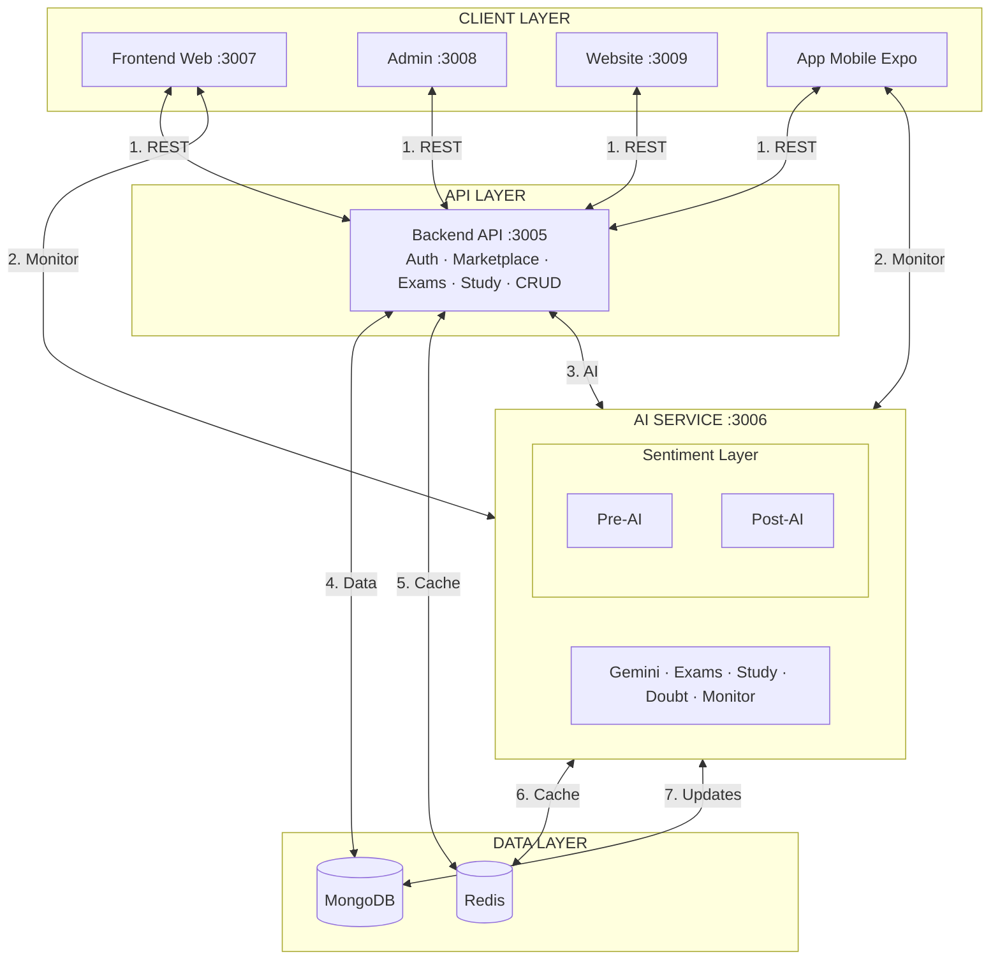
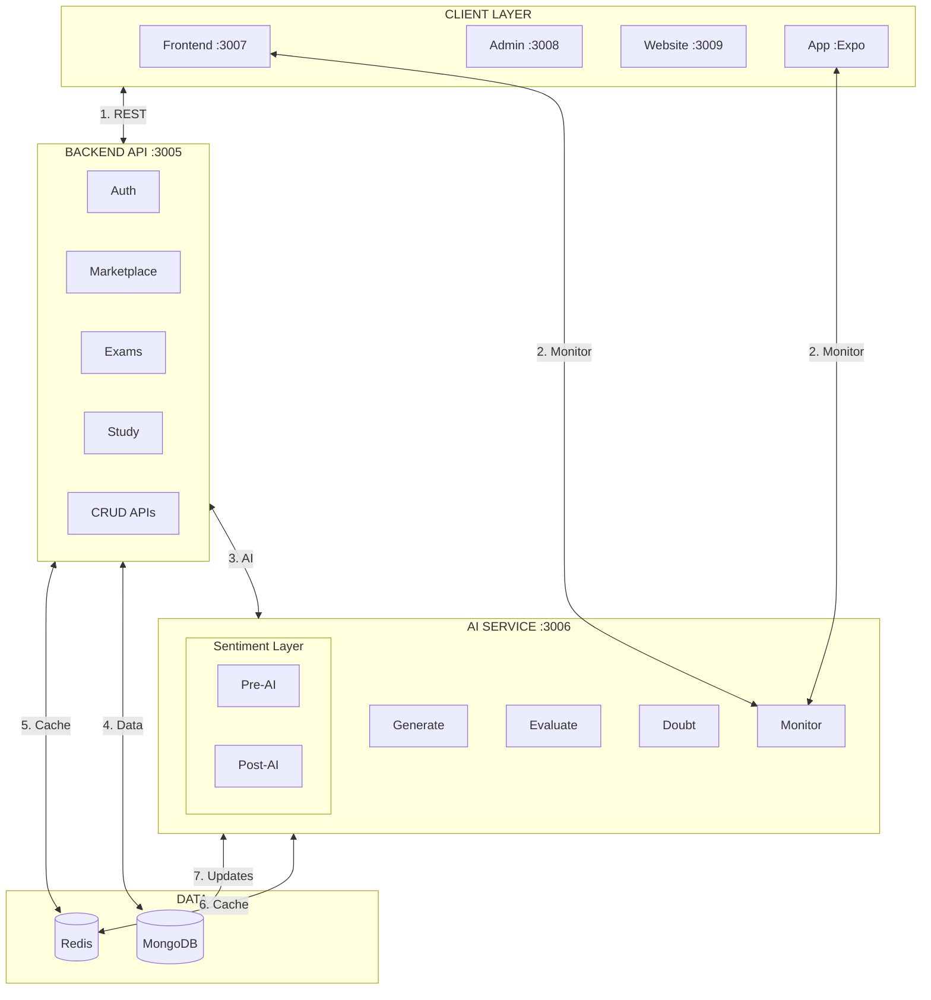
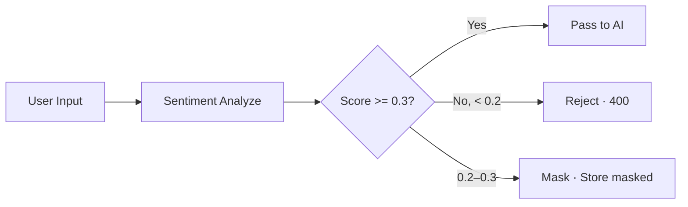
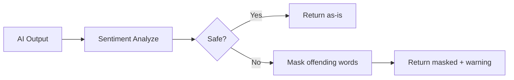
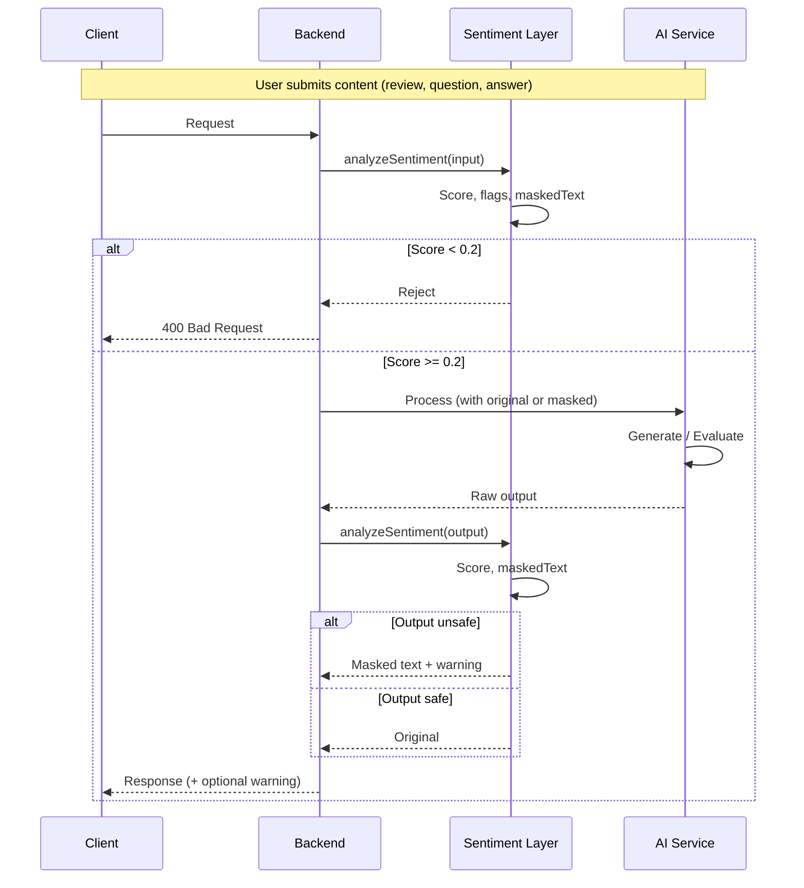

# GuruChakra Architecture

This document describes the architecture of the GuruChakra tuition platform—a multi-application system where parents find teachers, students attend live classes, and AI assists with exams, study materials, and classroom monitoring. **Content safety** is enforced via a **Sentiment Layer** that screens user input before AI processing and AI output before delivery.

---

## System Overview

GuruChakra is built as a **monorepo** with six deployable applications. Each application can run and deploy independently. The backend API is the central hub; all clients talk to it. The AI service is a separate microservice that the backend calls for heavy AI workloads. A **Sentiment & Content Safety Layer** wraps all AI interactions—screening user-generated content before it reaches AI and screening AI-generated content before it reaches users.



*Clients ↔ Backend (REST). Frontend & App ↔ AI Service (monitoring, direct). Sentiment is a layer inside AI Service. AI Service ↔ MongoDB for updates. All arrows bidirectional.*

---

## High-Level Architecture



**Flow:** (1) All clients ↔ Backend for API. (2) Frontend & App ↔ AI Service directly for real-time monitoring (JWT). (3) Backend ↔ AI for exam gen, evaluation, study, doubt. **Sentiment is a layer inside AI Service**—screens all input (including direct monitor calls) and output. (4–7) Backend & AI ↔ MongoDB & Redis.

---

## Detailed Architecture (Full Flow)



**Legend:** Sentiment is inside AI Service—screens all input (Backend, direct monitor) and output. (7) AI Service ↔ MongoDB for alerts, audit, persisted results.

---

## ASCII Architecture (Fallback)

```
┌─────────────────────────────────────────────────────────────────────────────────────────┐
│  CLIENT LAYER                                                                             │
│  ┌──────────┐ ┌──────────┐ ┌──────────┐ ┌──────────┐                                    │
│  │ Frontend │ │  Admin   │ │ Website  │ │   App    │                                    │
│  │  :3007   │ │  :3008   │ │  :3009   │ │  (Expo)  │                                    │
│  └────┬─────┘ └────┬─────┘ └────┬─────┘ └────┬─────┘                                    │
│       │            │            │            │                                            │
│       │  ◀──── REST ────▶       │            │  ◀──── REST ────▶                         │
│       └────────────┴────────────┴────────────┘                                            │
│       │                                                              │                     │
│       │  ◀──── Monitor (direct) ────▶                               │                     │
└───────┼──────────────────────────────────────────────────────────────┼─────────────────────┘
        │                                                              │
        ▼                                                              ▼
┌─────────────────────────────────────────────────────────────────────────────────────────┐
│  BACKEND API                                                                             │
│  ┌──────────────────────────────────────────────────────────────────────────────────┐  │
│  │  Node.js + Express  :3005                                                         │  │
│  │  Auth · Marketplace · Enrollments · Classes · Exams · Study · CRUD                 │  │
│  └──────────────────────────────────────────────────────────────────────────────────┘  │
│       │  ◀──────────────────────────────────────────────────────────────────▶         │
└───────┼─────────────────────────────────────────────────────────────────────────────────┘
        ▼
┌─────────────────────────────────────────────────────────────────────────────────────────┐
│  AI SERVICE  :3006                                                                      │
│  ┌──────────────────────────────────────────────────────────────────────────────────┐  │
│  │  SENTIMENT LAYER (inside AI)  Pre-AI ◀────────────────────────────▶ Post-AI     │  │
│  │  Gemini · Exam gen · Evaluation · Study · Doubt · Monitor                         │  │
│  └──────────────────────────────────────────────────────────────────────────────────┘  │
│       ▲  ◀──────────────── Monitor (direct) ────────────────▶  Frontend, App          │
└───────┼─────────────────────────────────────────────────────────────────────────────────┘
        │
        ▼
┌─────────────────────────────────────────────────────────────────────────────────────────┐
│  DATA LAYER                                                                             │
│  ┌─────────────────────┐  ◀──── Read/Write ────▶  ┌─────────────────────┐               │
│  │  MongoDB           │                          │  Redis               │               │
│  │  Backend + AI      │                          │  Cache · Jobs · JWT  │               │
│  └─────────────────────┘                          └─────────────────────┘               │
│       ▲  Backend, AI Service  ◀────────────────────────────────────────▶               │
└─────────────────────────────────────────────────────────────────────────────────────────┘
```

---

## Sentiment & Content Safety Layer

The **Sentiment Layer** is a layer **inside the AI Service**. It screens content **before** and **after** AI processing—whether the request comes from the Backend (exam gen, evaluation, study, doubt) or directly from Frontend/App (real-time monitoring). This ensures all AI interactions are safe for an educational audience.

### Flow: Before AI (Pre-Screening)



| Content Type | Action if Low Sentiment |
|--------------|-------------------------|
| Parent reviews | Reject if score &lt; 0.2; mask and store if 0.2–0.3 |
| Doubt questions | Reject if score &lt; 0.2 |
| Exam text answers | Mask in display; flag in feedback |

### Flow: After AI (Post-Screening)



| Content Type | Action if Low Sentiment |
|--------------|-------------------------|
| Doubt answers | Mask; return `answerWarning` |
| Study material | Mask before caching |
| Exam questions | Mask before delivery |
| Transcripts | Store masked; return `transcriptWarning` |
| Exam feedback | Mask answer text in `questionDetails`; set `lowSentimentWarning` |

### Sentiment API

- **AI Service:** `POST /v1/sentiment/analyze` (single), `POST /v1/sentiment/batch` (multiple)
- **Backend:** Uses AI service when configured; otherwise local Gemini via `@/lib/sentiment`
- **Score:** 0.0 (unsafe) to 1.0 (safe). Threshold: 0.3. Reject threshold: 0.2.

---

## AI + Sentiment Integration Flow



---

## Components

### Frontend (`frontend/`)

The main web application for parents, teachers, and students. Role-specific dashboards, marketplace, enrollments, classes, exams, study materials, and doubt center. Displays sentiment warnings (e.g. `lowSentimentWarning`, `transcriptWarning`) when content is masked.

**Tech:** React 19, Vite 6, React Router 7, Tailwind 4  
**Port:** 3007

### Admin (`admin/`)

Dashboard for platform operators. Manage teachers, parents, students, enrollments, classes, masters, AI-generated content, drafts, AI review requests. Shows sentiment flags (e.g. masked answers) in exam review details.

**Tech:** React 19, Vite 6, React Router 7, Tailwind 4  
**Port:** 3008

### Website (`website/`)

Single-page marketing site. Links to app and admin. Onboarding and branding.

**Tech:** React 19, Vite 6, Tailwind 4  
**Port:** 3009

### App (`app/`)

Mobile application for parents, teachers, and students. Mirrors frontend flows. Expo + React Native.

**Tech:** Expo 52, React Navigation 7, AsyncStorage  
**Port:** Expo dev server

### Backend (`backend/`)

Core API server. Auth, users, marketplace, enrollments, payments, classes, exams, study, notifications, admin CRUD. Delegates AI to AI service when configured; otherwise local Gemini. Integrates sentiment via `@/lib/sentiment` for reviews and local fallback.

**Tech:** Node.js, Express, TypeScript, Mongoose, Redis, BullMQ, JWT, bcrypt, Zod  
**Port:** 3005

### AI Service (`ai-service/`)

Standalone microservice for AI workloads. Exam generation, evaluation, study material, doubt answering, classroom/exam monitoring, document verification. **Sentiment analysis** for all user and AI content. Uses Google Gemini. Redis cache optional.

**Tech:** Node.js, Express, TypeScript, @google/genai, Redis (optional)  
**Port:** 3006

---

## Data Layer

### MongoDB

Primary data store. All persistent models:

| Model | Purpose |
|-------|---------|
| User | Auth, roles (student, parent, teacher, admin) |
| Teacher | Profile, batches, slots, board, classes, subjects |
| Parent | Profile, children (Student refs) |
| Student | Profile, parent, board, class, enrollments |
| Enrollment | Student–teacher–batch link, status, duration, slots |
| ClassSession | Scheduled classes, status, reschedule links |
| StudentExam | Exam attempts, questions, answers, scores, AI feedback, `lowSentimentWarning` |
| QualificationExam | Teacher qualification exam attempts |
| ClassRescheduleRequest | Reschedule requests and confirmations |
| TeacherReview | Parent reviews; `sentimentScore`, `reviewDisplay` (masked) |
| TeacherPayment | Teacher payments |
| PendingEnrollment | Checkout flow before payment |
| ParentWishlist | Wishlist |
| Notification | User notifications |
| Topic | Board/class/subject topics |
| BoardClassSubject | Board–class–subject mappings |
| Master | Board, class, subject masters |
| OTP | Phone OTP (TTL) |
| TeacherRegistration | Multi-step teacher registration |
| ParentRegistration | Parent registration |
| AIGeneratedContent | Cached AI content |
| AIAlert | AI monitoring alerts |
| AIReviewRequest | Human review requests for AI evaluations |

### Redis

- **Cache:** Backend and AI service when `REDIS_URL` is set.
- **BullMQ:** Schedule generation (hourly), notifications (every 15 min).
- **Token blacklist:** Blacklisted JWT tokens on logout.

### AI Service ↔ MongoDB

The AI Service may persist results to MongoDB (e.g. alerts, audit logs, cached content). In some flows, the Backend receives AI output and writes to MongoDB; in others (e.g. direct monitor), the AI Service may write directly.

---

## Infrastructure

- **Redis:** Started via `scripts/start-all.sh` (Docker or redis-server). Required for BullMQ.
- **Cron:** `/api/cron/generate-schedules`, `/api/cron/notifications` (e.g. cron.io).
- **Health:** Backend `/health` (MongoDB, Redis); AI service `/health` (Redis).

---

## Deployment Independence

Each application has its own `package.json` and can deploy independently:

- Backend (Railway, Render)
- AI service (separate container)
- Frontend, Admin, Website (Vercel, Netlify, S3)
- App (Expo EAS, App Store, Play Store)

**Shared:** `JWT_SECRET` (backend + AI service), `CORS_ORIGIN` (all client origins).

---

## Security

- **Auth:** JWT with `authMiddleware`, token blacklist in Redis.
- **Rate limiting:** 5 req/min auth; 500 req/15min general (configurable); 60 req/min AI.
- **CORS:** Explicit origin list per service.
- **AI Service:** `X-API-Key` or `Authorization: Bearer <JWT>`.
- **Content safety:** Sentiment layer screens all user and AI content; rejects or masks inappropriate material.

---

## Related Documentation

- [Data Flow](./DATA-FLOW.md) — request flows, sentiment integration
- [Component Connections](./COMPONENT-CONNECTIONS.md) — env vars, API contracts
- [Quick Start](./QUICK-START.md) — local setup
- [AI Fairness](./AI-FAIRNESS.md) — AI usage and fairness
